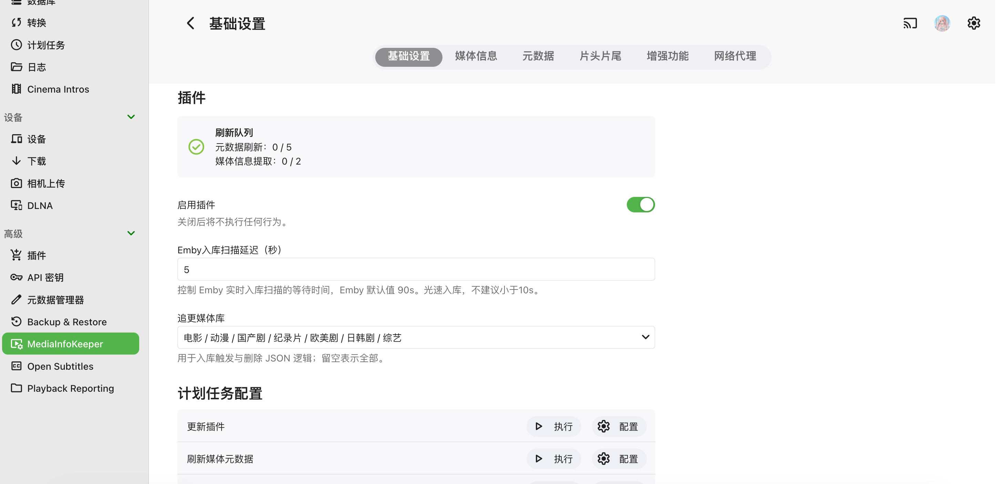

  

  
  
  
  
  
  
   
  
  

  

⏬ 安装
--------

1. 下载 dll 文件：[Releases](https://github.com/honue/MediaInfoKeeper/releases) 不带后缀的是通用版本，[最新通用版本](https://github.com/honue/MediaInfoKeeper/releases/latest/download/MediaInfoKeeper.dll)。
2. 放入 Emby 配置目录中的 `plugins` 目录。
3. 务必重命名为 `MediaInfoKeeper.dll`，否则后续自动更新会有两个 dll 存在。
4. 重启 Emby，在插件页面完成配置。

🧩 兼容性
-----------

- 版本说明：本仓库最新代码始终以支持 Emby 最新 release 为目标，开发过程中可能出现阶段性兼容问题。

- 当前插件 `latest` 版本适配Emby `4.9.5.0`，全平台支持。

- 更新限制：插件自动更新任务已按 [版本区间](Version.json) 限制，不会更新到当前 Emby 不支持的插件版本。

- 不支持：`4.8` 系列

⚖️ Lisence
-----------

本项目基于 [GNU General Public License v3.0](LICENSE) 开源。

- 二次开发、改名发布或重新打包 DLL 时，必须在用户可见位置标注原作者与原项目来源。
- 发布派生版本或二进制文件时，必须遵守 GPLv3，保留许可证，并公开对应版本源码或提供有效源码获取方式。

⭐ Stars
------------

  

🙏 致谢
----

本项目在部分功能设计、补丁思路与资源集成上参考或使用了以下开源项目，感谢各位对 Emby 社区的长期贡献：

- [StrmAssistant](https://github.com/sjtuross/StrmAssistant)：部分功能 Patch 思路以及 `simple` 分词器文件来源。

- [dd-danmaku](https://github.com/l429609201/dd-danmaku)：弹幕资源 `ede.js` 来源。
